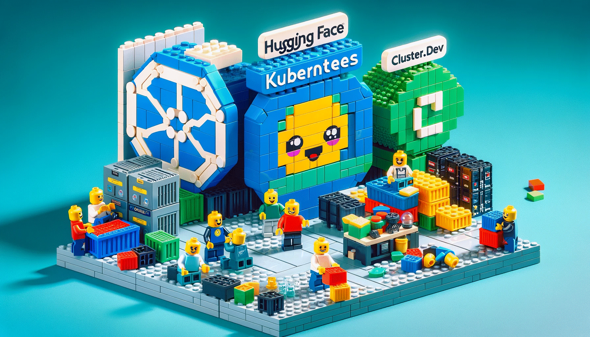

# Deploy HF Models and Chat to Kubernetes in 30 minutes



The goal in this article to show users how they could launch any LLM model from HuggingFace Hub with Chat into AWS cloud account on top of Kubernetes and make this production ready.

## HuggingFace TGI and Chat-UI

The Hugging Face beside models datasets and python libraries also ships Docker containers that allow inference in loca
There are two projects:

- [Text Generation Inference](https://github.com/huggingface/text-generation-inference/). Docker that could serve model.
- [Chat-UI](https://github.com/huggingface/chat-ui/). Docker image that could be used for chatting with model(like ChatGPT interface).

This looks enough if you need just deploy and test locally, but when you want to deploy this quickly to Kubernetes, there could be some pain and lot of configuration.

So we decided to simplify this journey for users who would like to just to spin some LLM models into their cloud accounts and don't want to bother with complex infrastructure development and management.

## Kubernetes, Helm, Terraform and Cluster.dev

Most of data scientist are using Python as an interface to test fine-tune and serve models, but when it comes to production, the DevOps teams need to pack tha into the infrastructure code. Additional point here is that with Kubernetes the price for GPU nodes would be at least 20% better then with Sagemaker, and you can scale them more flexible.
Most of the production infrastructures are provisioned using Terraform, and the software are deployed to Kubernetes with Helm.  

[Cluster.dev](https://cluster.dev) (its our open-source framework) was designed especially for the task when you need to deploy a complete infrastructure and software with minimum commands and documentation. You can think about it as InstallShield (next->next->install) but for the Terraform, Helm to install any software to your cloud accounts.

## Quick Start on EKS

To show the workflow we would use Amazon AWS cloud and managed EKS.
But this could be adapted for any other cloud and Kuberentes version.

### Prerequisites

- AWS cloud account credentials.
- [Cluster.dev](https://docs.cluster.dev/installation-upgrade/) and [Terraform](https://developer.hashicorp.com/terraform/downloads) installed.
- Route53 domain(optional)

Create an S3 Bucket for storing state files:

```bash
aws s3 mb s3://cdev-states
```

Clone repo with sample:

```bash
git clone https://github.com/shalb/cdev-examples/
cd cdev-examples/aws/eks-model/cluster.dev/
```

### Edit Configuration files

`project.yaml` - main project config. Sets common global variables for the current project such as organization, region, state bucket name etc. Also could be used to set global environment variables.

`backend.yaml` - configures backend for Cluster.dev states (including Terraform states). Uses variables from project.yaml.

`stack-eks.yaml` - describes AWS infrastructure configuration. Includes VPC, Domains and EKS(Kubernetes) settings. [Stack docs.](https://docs.cluster.dev/examples-aws-eks/)

The main configuration here about your GPU nodes, define its capacity_type (ON_DEMAND,SPOT), instance types and autoscalling (min/max/desired) settings. Also disk size and node labels if needed. Most important settings to configure next:

```yaml
  cluster_name: k8s-model # change this to your cluster name
  domain: cluster.dev # if you leave this domain it would be auto-delegated with zone *.cluster_name.cluster.dev
  eks_managed_node_groups:
    gpu-nodes:
      name: ondemand-gpu-nodes
      capacity_type: ON_DEMAND
      block_device_mappings:
        xvda:
          device_name: "/dev/xvda"
          ebs:
            volume_size: 120
            volume_type: "gp3"
            delete_on_termination: true
      instance_types:
        - "g5.xlarge"
      labels:
        gpu-type: "a10g"
      max_size: 1
      desired_size: 1
      min_size: 0
```

You can create any additional node groups, just by adding similar blocks to this yaml. The whole list of available settings could be found in relative [Terraform module](https://github.com/terraform-aws-modules/terraform-aws-eks/blob/master/examples/eks_managed_node_group/main.tf#L96).

`stack-model.yaml` - describes the HF model Stack. It refers to model stackTemplate in `model-template` folder, it also installs required Nvidia drivers.

The model stack mostly uses the values from the [huggingface-model Helm chart](https://github.com/shalb/charts/tree/main/huggingface-model) we have prepared and continue its development. List of all available options for chart could be checked in default [values.yaml](https://github.com/shalb/charts/blob/main/huggingface-model/values.yaml). Here are the main things you need to change:

```yaml
  chart:
    model:
      organization: "HuggingFaceH4"
      name: "zephyr-7b-beta"
    init:
      s3:
        enabled: false # if set to false the model would be cloned directly from HF git space
        bucketURL: s3://k8s-model-zephyr/llm/deployment/zephyr-7b-beta  # see ../bootstrap.ipynb on how to upload model
    huggingface:
      args:
        - "--max-total-tokens"
        - "4048"
        #- --quantize
        #- "awq"
    replicaCount: 1
    persistence:
      accessModes:
      - ReadWriteOnce
      storageClassName: gp2
      storage: 100Gi
    resources:
      requests:
        cpu: "2"
        memory: "8Gi"
      limits:
        nvidia.com/gpu: 1
    chat:
      enabled: true
```

## Deploy Stacks

After you finished the configuration, you need to run just one command to deploy everything:

```bash
cdev apply
```

Under the hood it would create the next set of resources:

```bash
Plan results:
+----------------------------+
|      WILL BE DEPLOYED      |
+----------------------------+
| cluster.route53            |
| cluster.vpc                |
| cluster.eks                |
| cluster.eks-addons         |
| cluster.kubeconfig         |
| cluster.outputs            |
| model.nvidia-device-plugin |
| model.model                |
| model.outputs              |
+----------------------------+
```

The process would take around 30 minutes, you can scroll this Asciinema to get an idea:

[](https://asciinema.org/a/622011)

## Working with Infrastructure

So lets imagine some tasks we can perform on top of the stack.

### Interacting with Kubernetes

After the stack would be deployed you will get the `kubeconfig` file that could be used for authorization to cluster and check workloads, logs etc..

```bash
# First we need to export KUBECONFIG to use kubectl
export KUBECONFIG=`pwd`/kubeconfig
# Then we can examine workloads deployed in `default` namespace, since we define it in stack-model.yaml
kubectl get pod
# To get logs from model run
kubectl logs -f <output pod from kubectl get pod>
# To list services 
```

### Changing node size and type

Lets imagine we have a large model and we need to serve it with some really large instances.
But we'd like to use spot-instances which are cheeper.
So we need just to change type of node-group:

```yaml
    gpu-nodes:
      name: spot-gpu-nodes
      capacity_type: SPOT
      block_device_mappings:
        xvda:
          device_name: "/dev/xvda"
          ebs:
            volume_size: 120
            volume_type: "gp3"
            delete_on_termination: true
      instance_types:
        - "g5.12xlarge"
      labels:
        gpu-type: "a10g"
      max_size: 1
      desired_size: 1
      min_size: 0
```

And then just apply changes by running `cdev apply`.  
Please note that spot instances not always available in region. If the spot request can't be fulfilled you can check in your AWS Console EC2 -> Auto Scaling groups -> eks-spot-gpu-nodes -> Activity, and when it fails try to change to `ON_DEMAND`, or change instance_types in manifest and re-run `cdev apply`.

### Changing the model

In case you need to change the model, also just edit its name and organization:

```yaml
    model:
      organization: "WizardLM"
      name: "WizardCoder-15B-V1.0"
```


